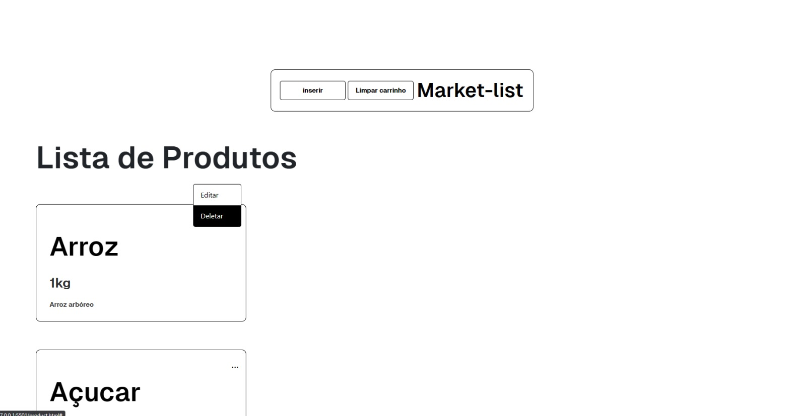

# Market-list
Uma projeto fullstack de lista de mercado para usar aqui em casa.

<p align="center">

</p>

## Funções 
* Inserir Produto;
* Ver Produto;
* Editar Produto;
* Apagar Produto;
* Apagar todos os produtos da lista.

## Tecnologias
* Node.js;
* Express;
* MongoDB;
* Mongoose;
* Cors.

## Como rodar 

```bash
# npm i
```
```bash
# npm start run
```
> port 3033

## Veja como é o projeto
- [Youtube](https://youtu.be/vUsFvCC-cD8) 


